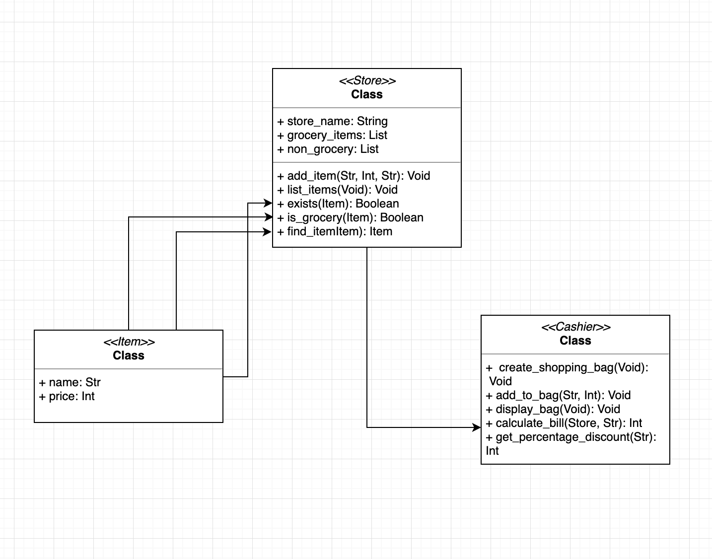

# E-commerce Website Discounts

## Runing the program
In order to run the e-commerce discount simulator, open the command line and type the command below. 
```
$ ./run.sh
```

## Test
To run the linter and test suite, use the following command from the command line.
```
$ ./test.sh
```

## UML Diagram

